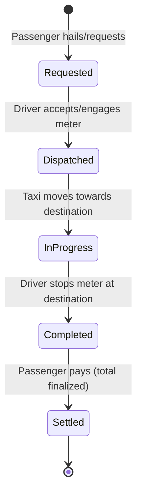

# NYC TLC Pipeline: Project Explanation

This document outlines the design and implementation of the NYC TLC Yellow Taxi pipeline across five key grading pillars.

## Pillar 1: Source Reasoning (20%)
To answer business questions regarding fleet utilization, revenue, fraud, and congestion impacts, we required data mapped to temporal, spatial, and financial metrics.
* **Business Questions to Source Mapping:**
  * Fleet Utilization & Demand: Mapped to `tpep_pickup_datetime`, `tpep_dropoff_datetime`, `PULocationID`, `DOLocationID` in the TLC trip records.
  * Revenue & Yield: Mapped to `fare_amount`, `tip_amount`, `total_amount`, and `payment_type`.
* **Data Grain & Ownership:** The data grain is 1 row per completed taxicab trip. It is owned by the NYC TLC, sourced from TPEP vendors (primarily Vendor IDs 1 and 2).
* **Freshness & Gaps:** The data is monthly batch processed (July 2026 data: ~3.53M rows). Gaps include 27.5% of rows having nulls across multiple fields (correlated with `payment_type=0`), an undocumented `RatecodeID = 99.0`, and missing data limiting real-time micro-routing analysis.

## Pillar 2: Data Retrieval (20%)
Data retrieval ensures data is safely loaded without modifying the raw source.
* **Retrieval Modes Used:**
  1. **Pandas:** Utilized `pd.read_parquet()` and `pd.read_csv()` to load the primary transaction records and the zone dimension lookup tables into memory.
  2. **DuckDB:** Employed DuckDB for executing fast SQL-based validations and aggregation queries directly against raw files or loaded dataframes, avoiding pandas memory overhead where possible.
* **Completeness Validation:** The pipeline includes a `validate_ingestion_completeness` check to verify that all rows from the raw files are accurately loaded into memory before processing begins.
* **Source Preservation:** The raw files located in `data/raw/` are treated as immutable and are never modified by the pipeline.

## Pillar 3: Profiling & Validation (20%)
Rigorous profiling revealed data quality issues, leading to the implementation of strict business rules.
* **Null Profiling Findings:** Profiling showed significant nulls, specifically 969,727 missing values (27.5%) in `passenger_count`, `RatecodeID`, `store_and_fwd_flag`, `congestion_surcharge`, and `Airport_fee`. `request_source` had 72.5% nulls.
* **Validation Rules:** 14 specific rules were applied:
  * **VR-001 (Date out of range):** Downstream aggregations for July 2026 will be skewed. (46 flagged)
  * **VR-002 (Negative duration):** Trip cannot end before it begins. (42,316 flagged)
  * **VR-003 (Duration too short <30s):** Represents meter errors or immediate cancellations. (33,038 flagged)
  * **VR-004 (Duration too long >24h):** Improbable continuous taxi trip. (37 flagged)
  * **VR-005 & VR-006 (Invalid PU/DO location):** Unmapped zones break spatial joins. (0 flagged)
  * **VR-007 (Zero trip distance):** Stationary meter or hardware failure. (128,322 flagged)
  * **VR-008 (Impossible speed >100mph):** Taxis cannot average >100mph in NYC. (909 flagged)
  * **VR-009 & VR-010 (Negative fare/total):** Drivers do not pay passengers. (14,200 & 14,699 flagged)
  * **VR-011 (Fare sum mismatch):** Ensures financial integrity. (1,390,885 flagged)
  * **VR-012 (Invalid RatecodeID):** Undocumented values prevent rate analysis. (53,756 flagged)
  * **VR-013 (Invalid VendorID):** Undocumented TPEP providers. (49,526 flagged)
  * **VR-014 (Missing mandatory fields):** Missing timestamps or spatial IDs render the row useless. (0 flagged)

## Pillar 4: Workflow Modeling & Metrics (20%)
The physical taxi trip is modeled logically into entity states.

### Workflow Entity-State Model

* **Enrichment:** Records were enriched with PU/DO Boroughs and Zones via spatial dimension joins, classified by trip types, and bucketed into time-of-day categories (Morning Rush, Midday, Evening Rush, Night, Early Morning).
* **Computed KPIs:**
  1. **Revenue Per Trip Mile:** `SUM(total_amount) / SUM(trip_distance)` (e.g., Manhattan: $30.82)
  2. **Average Trip Speed:** `SUM(trip_distance) / SUM(duration_hrs)` (e.g., Manhattan Morning Rush: 9.8 mph)
  3. **Tip Percentage:** `SUM(tip_amount) / SUM(fare_amount) * 100` (e.g., Manhattan: 26.3%)
  4. **Congestion Surcharge Burden:** `% of total_amount that is fees` (e.g., Manhattan: 11.8%)
  5. **Data Quality Yield:** `92.91%` (3,279,747 valid / 3,530,109 total).

## Pillar 5: Pipeline Dependability (20%)
The pipeline is designed for robustness, reliability, and auditability.
* **Execution & Idempotency:** Executable via a single command `python main.py`. It is idempotent, reading states to prevent redundant processing unless explicitly overridden using `--force`.
* **Logging:** Comprehensive logging to both console and `logs/` directory with precise timestamps to trace execution and failure points.
* **Failure Safety:** Utilizes stage-level `try/except` blocks ensuring that localized failures don't crash the entire runner without full traceback context.
* **No Silent Fixes:** Employed a strict boolean flag approach rather than silently dropping or coercing data. Invalid rows (250,362 rows) were separated into their own lineage rather than being destroyed, ensuring 100% data preservation and traceability.

---

## KUAL Table (Knowns, Unknowns, Assumptions, Limitations)

| Category | Item 1 | Item 2 | Item 3 | Item 4 | Item 5 |
| :--- | :--- | :--- | :--- | :--- | :--- |
| **Knowns** | Total trip volume is ~3.53M records for July 2026. | 27.5% of rows have nulls across key fields correlated strictly with `payment_type=0`. | There are 265 valid TLC zones (plus EWR and Unknown). | 14,200 trips resulted in negative fares. | Vendor IDs 1 and 2 are the standard TPEP providers. |
| **Unknowns** | The operational meaning of `RatecodeID = 99.0` (53,756 instances). | The true identity of undocumented `VendorID`s 6 and 7. | The exact routes or streets taken between PU and DO zones. | The meaning of `request_source`, which is 72.5% null. | Whether negative fares represent cancelled trips, refunds, or system tests. |
| **Assumptions** | Missing data with `payment_type=0` represents voided, aborted, or cash-disputed trips. | A $0.05 tolerance safely accounts for floating point anomalies in fare sums. | Trips under 30s are not meaningful passenger journeys and can be treated as anomalies. | `trip_distance` is measured via the taxi meter's odometer, not straight-line distance. | Only July 2026 data is relevant; the 46 out-of-range rows are logging artifacts. |
| **Limitations** | 27.5% missing data limits comprehensive revenue/demand analysis. | Zone-level spatial granularity limits micro-routing (street-by-street) optimization. | Monthly batch processing prevents real-time fleet dispatching use cases. | Lack of Driver/Medallion IDs prevents shift-level or driver-specific performance analysis. | High sparsity in `request_source` limits analysis on digital vs street hails. |
