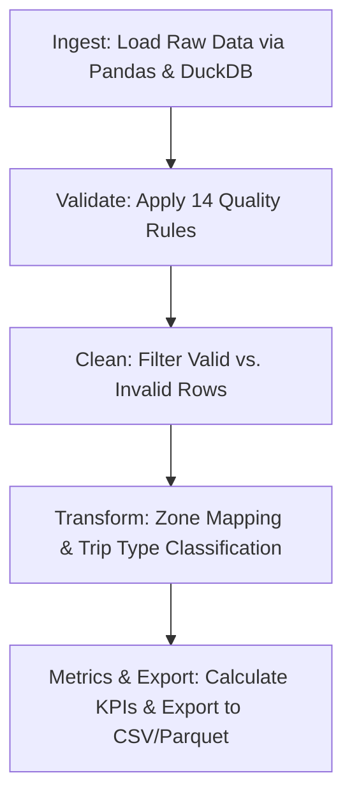

# NYC TLC Taxi Data Pipeline (FDE Data Foundations)

## 1. Problem Statement & Business Context

### Business Problem
NYC Taxi & Limousine Commission (TLC) Yellow Taxi operations generate millions of raw trip records across complex urban routes, variable pricing structures, and distinct time-of-day traffic patterns. However, raw trip logs are fragmented and noisy—containing erroneous trip durations, negative or zero fares, missing zone mappings, and out-of-order timestamps.

Leadership lacks a dependable, operational view of trip efficiency, delay hotspots, and revenue metrics across NYC boroughs. Without data validation and workflow modeling, operational decisions—such as driver allocation, congestion zone pricing evaluation, and route optimization—rely on untrusted, unvalidated numbers.

### Objective
As a Forward Deployed Engineer (FDE), the goal of this project is to construct a **repeatable, dependable data pipeline** that ingests raw TLC trip logs and zone reference data, applies strict data quality and validation rules, models trip workflows, and outputs trustworthy business KPIs for operational decision-making.

---

## 2. Raw Data Source Overview (`data/raw/*`)

The pipeline ingests raw source datasets stored in the `data/raw/` directory.

### A. `data/raw/taxi_zone_lookup.csv`
- **Format:** CSV File (Dimension Lookup Table)
- **Description:** Maps TLC Taxi Zone Location IDs to NYC Boroughs, specific neighborhood zones, and service zone classifications.
- **Grain:** 1 row per TLC Taxi Zone (`LocationID`).

| Column Name | Data Type | Description |
| :--- | :--- | :--- |
| `LocationID` | Integer | Primary key uniquely identifying each NYC taxi zone (1 to 265). Maps to `PULocationID` and `DOLocationID` in trip records. |
| `Borough` | String | NYC borough where the zone is located (e.g., `Manhattan`, `Queens`, `Brooklyn`, `Bronx`, `Staten Island`, `EWR`). |
| `Zone` | String | Specific neighborhood or zone name (e.g., `JFK Airport`, `Alphabet City`, `Midtown Center`). |
| `service_zone` | String | Operational category of the zone (e.g., `Yellow Zone`, `Boro Zone`, `Airports`, `EWR`). |

---

### B. `data/raw/yellow_tripdata_2026-07.parquet`
- **Format:** Apache Parquet (Transactional Fact Table)
- **Description:** Transactional trip records detailing individual Yellow Taxi hails in NYC for July 2026.
- **Grain:** 1 row per completed taxi trip.

| Column Name | Data Type | Description |
| :--- | :--- | :--- |
| `VendorID` | Integer | TPEP provider code (e.g., `1` = Creative Mobile Technologies, `2` = VeriFone Inc.). |
| `tpep_pickup_datetime` | Timestamp | Date and time when the taximeter was engaged (pickup time). |
| `tpep_dropoff_datetime` | Timestamp | Date and time when the taximeter was disengaged (dropoff time). |
| `passenger_count` | Integer / Float | Number of passengers in the vehicle (driver-entered value). |
| `trip_distance` | Float | Elapsed trip distance reported by the taximeter in miles. |
| `RatecodeID` | Integer | Metered rate code in effect (e.g., `1` = Standard, `2` = JFK, `3` = Newark, `4` = Nassau/Westchester, `5` = Negotiated, `6` = Group ride). |
| `store_and_fwd_flag` | String | Flag (`Y`/`N`) indicating if the trip record was stored in vehicle memory before transmission. |
| `PULocationID` | Integer | TLC Taxi Zone location ID where the trip passenger was picked up. |
| `DOLocationID` | Integer | TLC Taxi Zone location ID where the trip passenger was dropped off. |
| `payment_type` | Integer | Payment method code (`1` = Credit Card, `2` = Cash, `3` = No Charge, `4` = Dispute, `5` = Unknown, `6` = Voided). |
| `fare_amount` | Float | Meter-calculated time-and-distance fare in USD. |
| `extra` | Float | Miscellaneous surcharges (e.g., $0.50 overnight / $1.00 rush hour charges). |
| `mta_tax` | Float | Standard $0.50 MTA tax automatically assessed on metered trips. |
| `tip_amount` | Float | Tip amount paid via credit card (cash tips not captured). |
| `tolls_amount` | Float | Total dollar amount of all tolls paid during the trip. |
| `improvement_surcharge` | Float | $0.30 improvement surcharge assessed on hailed trips. |
| `total_amount` | Float | Total passenger cost per trip, combining fares, fees, surcharges, tolls, and tips. |
| `congestion_surcharge` | Float | Congestion surcharge collected for trips in NY State congestion zones. |
| `Airport_fee` | Float | $1.25 location fee for pickups at NYC airports (JFK / LaGuardia). |
| `cbd_congestion_fee` | Float | Central Business District congestion fee. |
| `request_source` | String | Source system or dispatch application identifier. |

---

## 3. Project Structure

```text
nyc-tlc-pipeline/
├── config.py
├── data/
│   ├── processed/
│   └── raw/
├── docs/
│   └── business_rules_spec.md
├── logs/
├── main.py
├── outputs/
│   ├── figures/
│   └── reports/
│       ├── audit_log.json
│       └── metrics_summary.csv
├── pyproject.toml
├── README.md
├── src/
│   ├── clean.py
│   ├── export.py
│   ├── ingest.py
│   ├── __init__.py
│   ├── metrics.py
│   ├── transform.py
│   └── validate.py
└── tests/
```

## 4. Setup & Installation
```bash
cd nyc-tlc-pipeline
python3 -m venv .venv
source .venv/bin/activate
pip install pandas pyarrow duckdb pytest matplotlib seaborn
```

## 5. Running the Pipeline
```bash
python main.py          # First run
python main.py --force  # Force rerun
```

## 6. Running Tests
```bash
python -m pytest tests/ -v
```

## 7. Pipeline Architecture


## 8. Key Metrics

| KPI | Formula | Business Interpretation |
| :--- | :--- | :--- |
| **Revenue Per Trip Mile** | `SUM(total_amount) / SUM(trip_distance)` | Financial efficiency of a route. |
| **Average Trip Speed (mph)** | `SUM(trip_distance) / SUM((dropoff_datetime - pickup_datetime) in hours)` | Traffic fluidity and operational efficiency. |
| **Tip Percentage** | `SUM(tip_amount) / SUM(fare_amount) * 100` | Passenger satisfaction and willingness to tip. |
| **Congestion Surcharge Burden** | `SUM(congestion_surcharge + cbd_congestion_fee) / SUM(total_amount) * 100` | Percentage of bill that is regulatory fees. |
| **Data Quality Yield** | `(COUNT(valid_rows) / COUNT(total_rows)) * 100` | Health of the TPEP vendor data feeds. |

## 9. KUAL Table (Knowns, Unknowns, Assumptions, Limitations)

| Category | Item 1 | Item 2 | Item 3 | Item 4 | Item 5 |
| :--- | :--- | :--- | :--- | :--- | :--- |
| **Knowns** | Total trip volume is ~3.53M records for July 2026. | 27.5% of rows have nulls across key fields correlated strictly with `payment_type=0`. | There are 265 valid TLC zones (plus EWR and Unknown). | 14,200 trips resulted in negative fares. | Vendor IDs 1 and 2 are the standard TPEP providers. |
| **Unknowns** | The operational meaning of `RatecodeID = 99.0` (53,756 instances). | The true identity of undocumented `VendorID`s 6 and 7. | The exact routes or streets taken between PU and DO zones. | The meaning of `request_source`, which is 72.5% null. | Whether negative fares represent cancelled trips, refunds, or system tests. |
| **Assumptions** | Missing data with `payment_type=0` represents voided, aborted, or cash-disputed trips. | A $0.05 tolerance safely accounts for floating point anomalies in fare sums. | Trips under 30s are not meaningful passenger journeys and can be treated as anomalies. | `trip_distance` is measured via the taxi meter's odometer, not straight-line distance. | Only July 2026 data is relevant; the 46 out-of-range rows are logging artifacts. |
| **Limitations** | 27.5% missing data limits comprehensive revenue/demand analysis. | Zone-level spatial granularity limits micro-routing (street-by-street) optimization. | Monthly batch processing prevents real-time fleet dispatching use cases. | Lack of Driver/Medallion IDs prevents shift-level or driver-specific performance analysis. | High sparsity in `request_source` limits analysis on digital vs street hails. |

## 10. Key Findings
- **Data Yield:** Processed 3,530,109 total rows. Output resulted in 3,279,747 valid rows (92.9%) and 250,362 invalid rows (7.1%).
- **Top Anomalies:** 1,390,885 rows had fare sum mismatches (often due to rounding/floating points or misconfigured surcharges). 128,322 had zero distance. 42,316 had negative duration.
- **Performance Highlights:** 
  - Manhattan had a mean tip percentage of 26.3% and the highest total volume. EWR trips had extremely high revenue per mile but very low volume.
  - Speeds predictably dropped during morning/evening rushes and were highest late at night/early morning.
