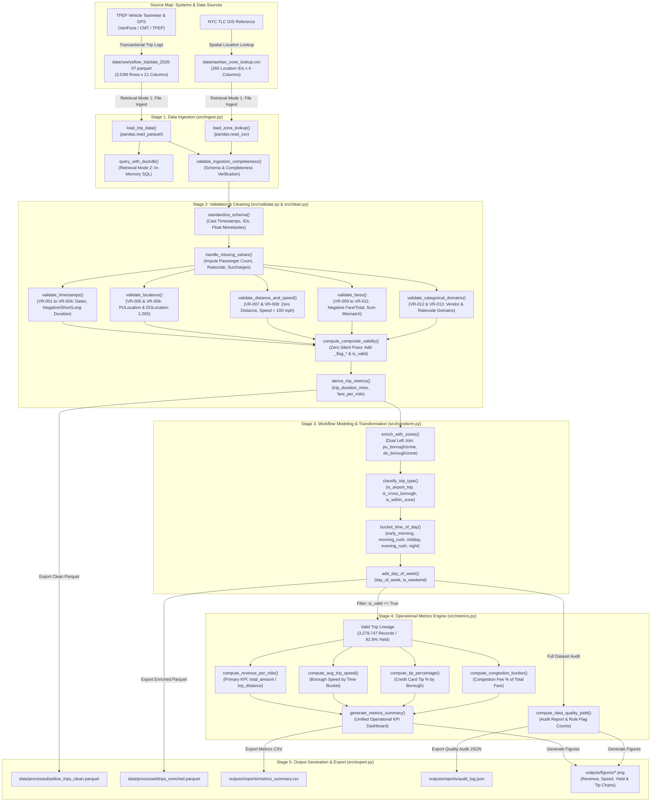
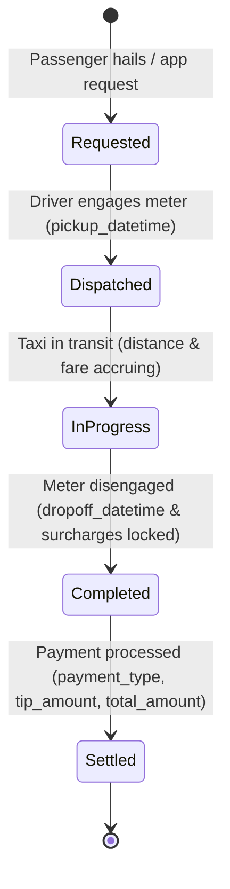

# NYC TLC Pipeline: Source Map & Workflow Data Model Diagram

This document contains the end-to-end **Source Map**, **Workflow Data Model**, and **Pipeline Architecture Diagram** for the NYC TLC Yellow Taxi data processing pipeline, as required by the FDE Data Foundations Assignment specifications.

---

## 📐 End-to-End Pipeline & Source Map Diagram

---

## 🗺️ Source Map Summary

| Source System | Data Source File | Storage Format | Grain | Ingestion Mode | Ownership & Description |
| :--- | :--- | :--- | :--- | :--- | :--- |
| **TPEP Vehicle Meters** | `data/raw/yellow_tripdata_2026-07.parquet` | Apache Parquet | 1 row per logged taxi hail | Mode 1: File (`read_parquet`) Mode 2: SQL (`DuckDB`) | NYC TLC / Authorized Vendors (CMT, VeriFone). Transactional trip data (~3.53M rows). |
| **NYC TLC GIS System** | `data/raw/taxi_zone_lookup.csv` | CSV | 1 row per TLC Taxi Zone | Mode 1: File (`read_csv`) | NYC TLC. Master spatial dimension mapping 265 Location IDs to NYC Boroughs & Zones. |

---

## 🔄 Trip Entity State Lifecycle Model

